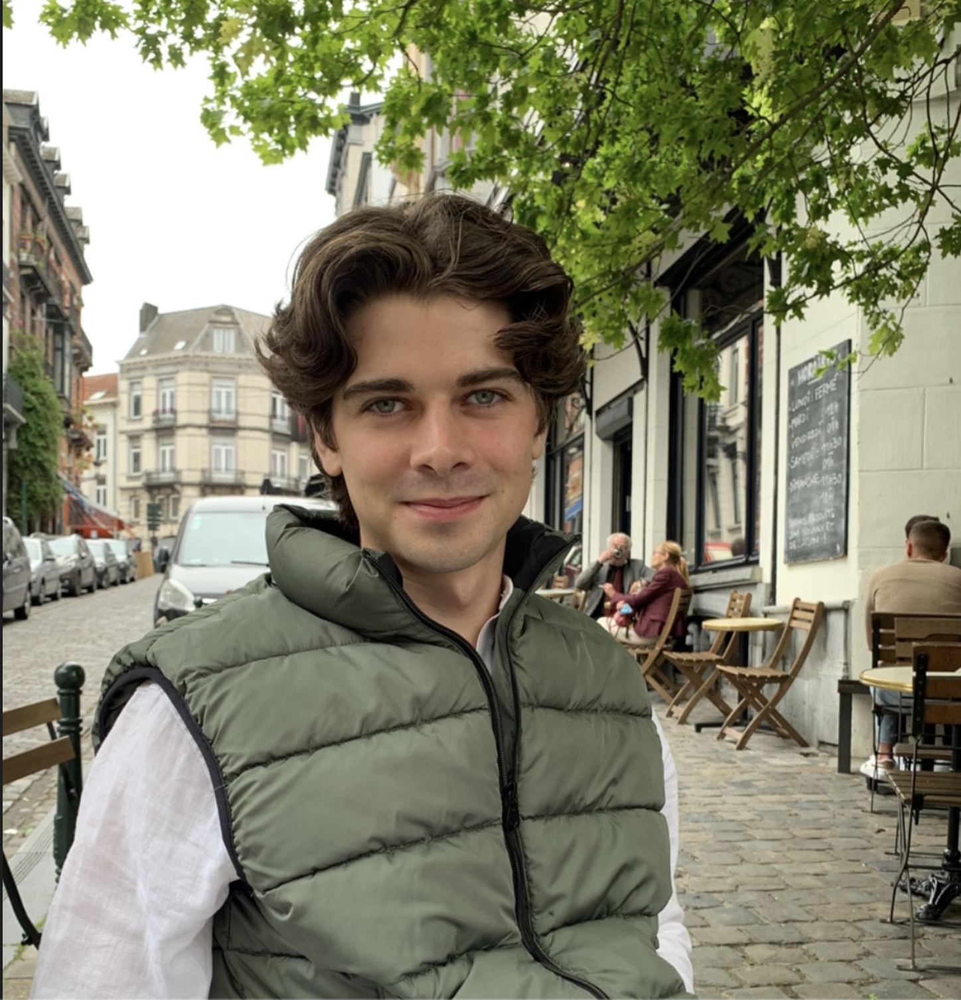

 

Hello, I'm Christian. I am currently studying for a master's in Human-centered Artificial Intelligence at the Technical University of Denmark. In June this summer, I finished my bachelor's degree in 
Artificial 
Intelligence & Data Science.

With this post, my blog begins, where I will post different stories trying to investigate and explore various topics using data science and machine learning. The purpose is to practice my communication 
skills w.r.t. presenting technical content to non-technical peers. I hope you will participate in this experiment, and any feedback would be very appreciated.
